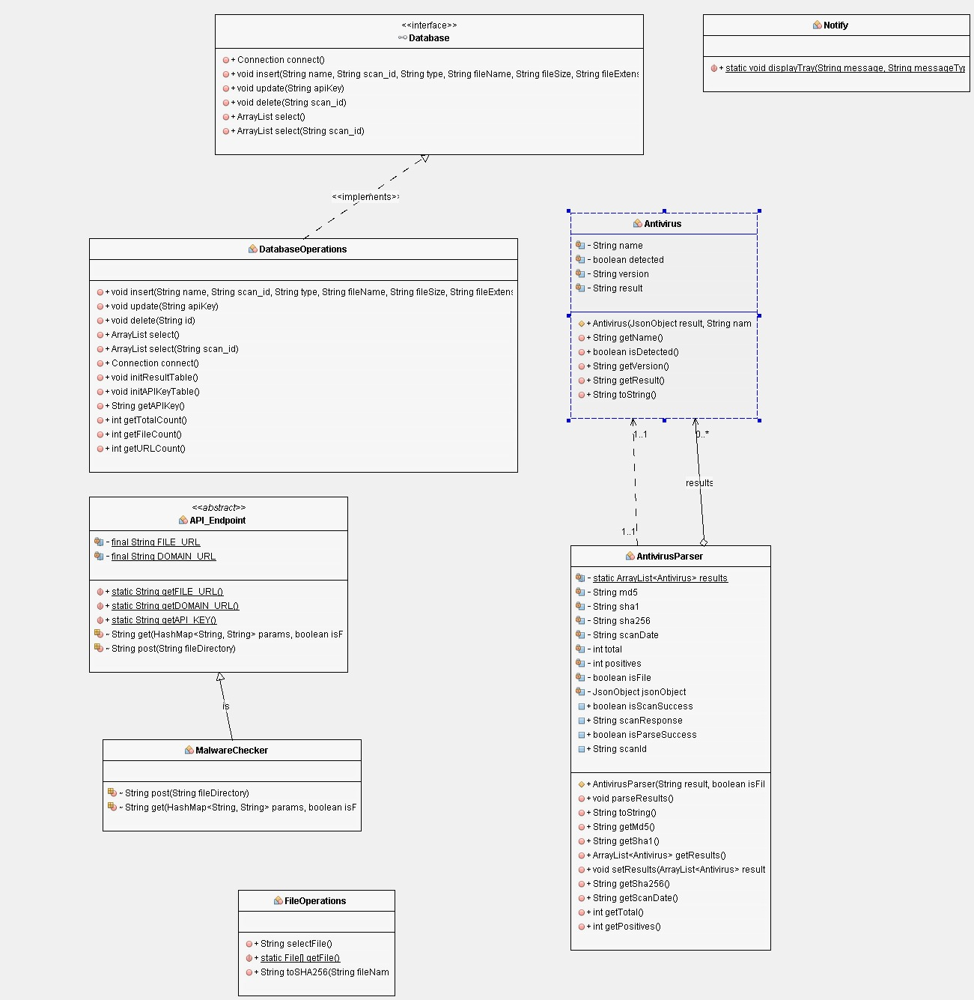

# Detectify (a VirusTotal Desktop Application)

> Detectify is a free file, hash and URL scanning system based on VirusTotal.  

> This project also has been developed as part of CENG201 Projects.

 

## Get your API key

## Enter into Detectify

## Scan files

## Scan URLs

## Scanned Files

## UML Diagram

## Team

> Or Contributors/People

| <a href="https://github.com/canumay" target="_blank">**@canumay**</a> | <a href="https://github.com/AlperErkol" target="_blank">**@AlperErkol**</a> | <a href="https://github.com/lumiaveled" target="_blank">**@lumiaveled**</a> |
| :---: |:---:| :---:|
|     |  |   |
| <a href="http://github.com/canumay" target="_blank">`Can Umay`</a> | <a href="http://github.com/AlperErkol" target="_blank">`Alper Erkol`</a> | <a href="http://github.com/lumiaveled" target="_blank">`Doğukan Eren`</a> |

## License

- **[MIT license](http://opensource.org/licenses/mit-license.php)**
